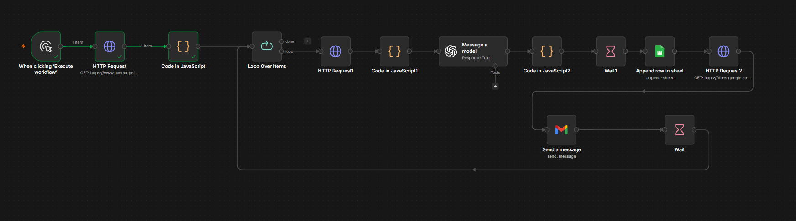
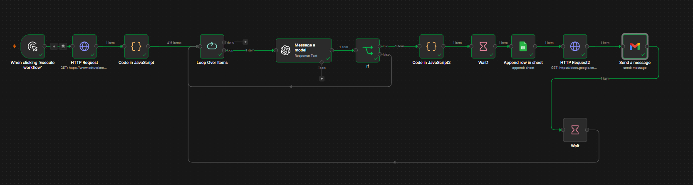

# 🚀 Dynamic AI-Powered Resume Sender (n8n & OpenAI)

This project is a modular, production-ready n8n pipeline designed to automate cold emailing for job seekers. It dynamically scrapes target company listings, uses OpenAI to generate tailored cover letters based on the company's profile, dispatches personalized emails via Gmail API with attachments, and logs the entire pipeline's state into Google Sheets in real-time.

---

## 📂 Choose Your Architecture Version

This repository actively maintains two operational versions of the automation pipeline depending on your corporate scaling needs:

### 🌟 Version 1.0 (Standard Automation)
* **Workflow Source:** `resume_sender_gmail.json`
* **Core Scripts:** `clean_code_blocks.js`
* **Visual Map:** 


### 🌟 Version 2.0 (Smart Industry Filtering & Suffix Cleanup) - *Latest*
* **Workflow Source:** `resume_sender_gmail2.json`
* **Core Scripts:** `clean_code_blocks2.js`
* **Visual Map:** 


---

## ✨ Core Features (v1.0 & v2.0)

* **Flexible Web Scraping:** Abstracted scraping layer using optimized Regex tokens, allowing easy adaptation to any corporate directory or technology park index.
* **Resilient Loop Orchestration:** Implements structured data batching and dynamic throttling to fully comply with e-mail server guidelines and API execution limits.
* **State Preservation & Fault Tolerance:** Configured with advanced error-handling and slicing mechanisms (`.slice(index)`). If an API quota limitation (429 Too Many Requests) occurs, the workflow can be restarted seamlessly from the exact failure offset.
* **Context-Aware AI Generation:** Leverages OpenAI LLM nodes to craft organic, high-converting, and non-generic cover letters tailored to each company's domain.
* **Automated Logging:** Saves the delivery status, timestamp, and metadata into Google Sheets for precise application tracking.

### 🛠️ v2.0 Key Advancements:
* **Corporate Suffix Stripping:** Automatically parses and removes heavy legal extensions (e.g., converting *"AEON GAME OYUN STÜDYO YAZILIM A.Ş."* into a natural *"Aeon Game"*) for professional, human-like email greetings.
* **Automated Industry Filtering:** Evaluates target company profiles against engineering competencies. If a firm belongs to an out-of-scope sector (e.g., construction, textiles), it sets the email parameter to `null` and instantly skips it.
* **Smart Conditional Guardrails:** The updated `If Node` filters out null inputs immediately, bypassing execution loops before hitting API faults or wasting tokens.

---

## 🛠️ Technology Stack

* **n8n** (Advanced Workflow Automation)
* **JavaScript** (Node.js / n8n Sandbox Execution Environment)
* **OpenAI API** (GPT-4o Engine Integration)
* **Gmail API** (OAuth2 Automated Dispatch)
* **Google Sheets API** (Distributed Ledger/Log Matrix)

---

## 📦 Deployment & Setup

1. Clone or download your preferred workflow version (`.json` file) from this repository.
2. Open your n8n workspace and create a blank workflow.
3. Click the top-right menu and select **Import from File** to upload the JSON payload.
4. Update the initial HTTP Request node target to your desired job/company directory.
5. Configure the JavaScript node regex pattern to parse the HTML schema of your chosen source.
6. Attach your OpenAI API Key, Gmail OAuth2, and Google Sheets app credentials.
7. Adjust the Wait (Delay) parameters according to your API quotas, and hit **Execute Workflow**.

---

## 📄 Core Script Architecture

Advanced data manipulation, response sanitization (stripping rogue LLM markdown blocks like ````json```), and array state indexing are handled via specialized JavaScript sandboxes. You can review the precise code snippets inside `clean_code_blocks.js` (for v1) and `clean_code_blocks2.js` (for v2).

Developed with ❤️ by Ahmet Cevdet Bülbül
