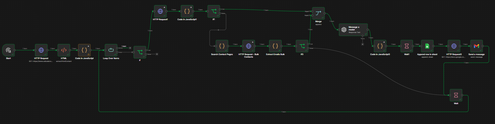

# 🚀 Dynamic AI-Powered Resume Sender (n8n & OpenAI)

This project is an enterprise-grade, highly modular, and production-ready n8n pipeline designed to automate cold outreach and application processes for job seekers. By integrating asynchronous web scraping, concurrent multi-path crawling, context-aware Generative AI, and unified data pipelines, this system automates the target discovery, personalization, verification, and dispatch phases of a cold email campaign.

---

## 📂 Choose Your Architecture Version

This repository maintains three operational versions of the automation pipeline depending on your corporate scaling and crawling needs:

### 🌟 Version 1.0 (Standard Automation)
* **Workflow Source:** `resume_sender_gmail.json`
* **Core Scripts:** `clean_code_blocks.js`
* **Visual Map:** 

### 🌟 Version 2.0 (Smart Industry Filtering & Suffix Cleanup)
* **Workflow Source:** `resume_sender_gmail2.json`
* **Core Scripts:** `clean_code_blocks2.js`
* **Visual Map:** 

### 🌟 Version 3.0 (Advanced Multi-Stage Contact Discovery & Unified Sandbox Execution) - *Latest*
* **Workflow Source:** `resume_sender_gmail3.json`
* **Visual Map:** 

---

## ⚙️ Detailed Node-by-Node Technical Reference (v3.0)

Below is the exhaustive technical specification of every node operating in the latest pipeline (v3.0), mapping their operational logic, input requirements, and downstream outputs.

### 1. Ingestion & Preprocessing Phase

#### 🔹 Start (Manual Trigger)
* **Type:** `n8n-nodes-base.manualTrigger`
* **Purpose:** Serves as the developer entrance point for on-demand execution, testing, and sandbox validation.
* **Outputs:** Empty trigger payload initiating the execution thread.

#### 🔹 HTTP Request (Target Directory Scraper)
* **Type:** `n8n-nodes-base.httpRequest`
* **Purpose:** Performs a secure GET request to the target industry or technopark corporate listings database.
* **Technical Spec:** Returns the raw HTML document containing table schemas of companies and corresponding domain hyperlinks.

#### 🔹 HTML (DOM Parser)
* **Type:** `n8n-nodes-base.html`
* **Purpose:** Parses the scraped HTML payload using custom CSS selectors to split raw data into manageable arrays.
* **Selectors:** Extracts company names via `table tr td:nth-child(1)` and domain links via `table tr td:nth-child(2) a (href attribute)`.
* **Outputs:** Two synchronized arrays containing string elements of company names and website URLs.

#### 🔹 Code in JavaScript (Normalization & Exclusions)
* **Type:** `n8n-nodes-base.code` (Sandbox Mode)
* **Purpose:** Cleans the parsed raw strings, executes string normalization, filters out pre-configured skip lists, and manages pipeline state recovery.
* **Logic:** * Normalizes regional/unicode characters to standard alphanumeric symbols.
  * Checks current loops against a hardcoded array of previously processed target companies.
  * Employs an offset index limit (e.g., `< 340`) allowing developers to skip already processed segments during a cold restart.
  * Formats target URLs to ensure secure protocol prefixes (`https://`).

#### 🔹 Loop Over Items (Orchestrator)
* **Type:** `n8n-nodes-base.splitInBatches`
* **Purpose:** Controls loop execution, processing target leads one by one to prevent rate-limit blocks (HTTP 429) and secure operational safety.

---

### 2. Multi-Route Contact Discovery Phase

#### 🔹 If (Website Verification)
* **Type:** `n8n-nodes-base.if`
* **Purpose:** Evaluates whether the current company in the batch has a valid website domain.
* **Routes:** If `true`, routes to direct scraping; if `false`, skips to loop completion to save execution power.

#### 🔹 HTTP Request1 (Direct Landing Scraper)
* **Type:** `n8n-nodes-base.httpRequest`
* **Purpose:** Performs a high-timeout GET request on the target's primary root domain to locate raw e-mail footprints.

#### 🔹 Code in JavaScript1 (Direct Regex Extraction)
* **Type:** `n8n-nodes-base.code`
* **Purpose:** Uses a highly optimized Regular Expression token `/ [A-Z0-9._%+-]+@[A-Z0-9.-]+\.[A-Z]{2,} /gi` to sweep the root HTML content for email addresses.

#### 🔹 If1 (Primary Match Validator)
* **Type:** `n8n-nodes-base.if`
* **Purpose:** Inspects whether the direct landing page scraper successfully yielded any email addresses.
* **Routes:**
  * **True Branch:** Routes straight to the `Merge` node to proceed with content generation.
  * **False Branch (Fallback):** Routes to the **Asynchronous Deep Crawling** branch (`Search Contact Pages`).

#### 🔹 Search Contact Pages (Deep Route Generator)
* **Type:** `n8n-nodes-base.code`
* **Purpose:** Programmatically generates a flat list of 8 high-probability sub-directories (e.g., `/contact`, `/iletisim`, `/career`, `/about-us`) appended to the root domain.
* **Outputs:** 8 distinct JSON payloads targeting alternative contact nodes.

#### 🔹 HTTP Request - Bulk Contacts (Concurrent Crawler)
* **Type:** `n8n-nodes-base.httpRequest`
* **Purpose:** Concurrently dispatches 8 separate GET requests to the generated sub-directories under a safe timeout threshold.

#### 🔹 Extract Emails Bulk (Aggregation & Deduplication)
* **Type:** `n8n-nodes-base.code`
* **Purpose:** Aggregates all concurrent HTML responses returned by the bulk crawler, scans them collectively for emails using Regex, and dedupes duplicates using a JavaScript `Set`.

#### 🔹 If3 (Secondary Match Validator)
* **Type:** `n8n-nodes-base.if`
* **Purpose:** Verifies if the secondary deep crawl found any valid email addresses.
* **Routes:**
  * **True Branch:** Routes the deduplicated emails to the `Merge` node.
  * **False Branch:** Routes the thread to a cooling delay, skipping the current company to avoid wasting API tokens.

#### 🔹 Merge (Data Synchronizer)
* **Type:** `n8n-nodes-base.merge`
* **Purpose:** Acts as a data junction. Synchronizes data streams coming from either the successful *Direct Landing* branch or the *Deep Crawler* branch, passing a unified payload forward.

---

### 3. AI Coprocessor & Delivery Phase

#### 🔹 Message a Model (OpenAI GPT-4o-mini)
* **Type:** `@n8n/n8n-nodes-langchain.openAi`
* **Purpose:** Generates a highly personalized, context-aware job application and cover letter.
* **Prompt Instructions:**
  * Evaluates the company's profile.
  * Tailors technical skill focus (e.g., Software Engineering vs. Embedded/Hardware Systems) dynamically based on company scope.
  * Enforces writing guardrails (no AI clichés, humble but professional tone, custom Turkish greeting structures, proper corporate suffix handling).
* **Target Output:** A clean, raw JSON payload containing `"subject"` and `"body"`.

#### 🔹 Code in JavaScript3 (Sanitization & Parser)
* **Type:** `n8n-nodes-base.code`
* **Purpose:** Sanitizes LLM outputs. Strips out raw markdown code wrappers (such as ````json````), parses the remaining string into a native JSON object, and maps variables correctly. Includes a fail-safe fallback template in case of parsing errors.

#### 🔹 Wait1 (Pre-Logging Delay)
* **Type:** `n8n-nodes-base.wait`
* **Purpose:** Introduces a small operational pause to balance database API transaction queues.

#### 🔹 Append Row in Sheet (Distributed Ledger)
* **Type:** `n8n-nodes-base.googleSheets`
* **Purpose:** Records the transaction history in real-time, mapping Company Name, Website, Extracted Email, and Timestamp.

#### 🔹 HTTP Request3 (Dynamic Resume Downloader)
* **Type:** `n8n-nodes-base.httpRequest`
* **Purpose:** Pulls the latest live version of the candidate's Resume/CV as a binary stream from a remote secure storage link immediately before dispatch. This ensures outbound files are always up-to-date.

#### 🔹 Send a Message (Gmail Dispatcher)
* **Type:** `n8n-nodes-base.gmail`
* **Purpose:** Dispatches the personalized email to the extracted recipient, appending the newly downloaded CV binary as an attachment.

#### 🔹 Wait (Throttling Cooldown)
* **Type:** `n8n-nodes-base.wait`
* **Purpose:** Imposes a mandatory 15-second delay before starting the next loop cycle, protecting the sender domain's IP reputation and staying within Gmail/API quota guidelines.

---

## 🛠️ Technology Stack

* **n8n** (Core Orchestrator & Multi-Branch Engine)
* **JavaScript** (Data Normalization, Aggregation, and Sanitization Sandboxes)
* **OpenAI API** (Contextual Cover Letter Engine via GPT-4o-mini)
* **Gmail API** (OAuth2 Automated Mail Delivery)
* **Google Sheets API** (State Preservation Ledger)

---

## 📦 Deployment & Setup

1. Clone or download your preferred workflow version (`.json` file) from this repository.
2. Open your n8n workspace and create a blank workflow.
3. Click the top-right menu and select **Import from File** to upload the JSON payload.
4. Update the initial HTTP Request node target to your desired job/company directory.
5. Configure the JavaScript node regex pattern to parse the HTML schema of your chosen source.
6. Attach your OpenAI API Key, Gmail OAuth2, and Google Sheets app credentials.
7. Adjust the Wait (Delay) parameters according to your API quotas, and hit **Execute Workflow**.

---

Developed with ❤️ by Ahmet Cevdet Bülbül
